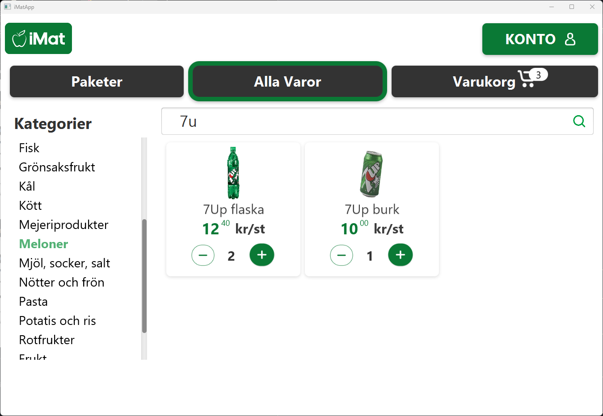

## iMatApp  
Very simple shopping application for groceries aimed to be used by elderly people.

## Installation
Clone the repository and run the following command in the root directory of the project:
```
mvn clean install
```
## Usage
Run the following command in the root directory of the project:
```
mvn exec:java
```
or run the follwing jar file
``` 
java -jar iMapApp.jar
``` 
## Contributors
* [ismail424](https://github.com/ismail424)
* [AronLundh]( https://github.com/AronLundh)
* [IsmailR16](https://github.com/IsmailR16)
* [p0ntu2](https://github.com/p0ntu2)


## Screenshots 
<p float="left">
    
    
    
</p>

<p float="left">
    
    
    
</p>

<p float="left">
    
    
    
</p>

<p float="left">
    
    
</p>


